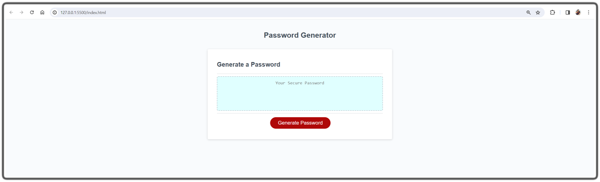
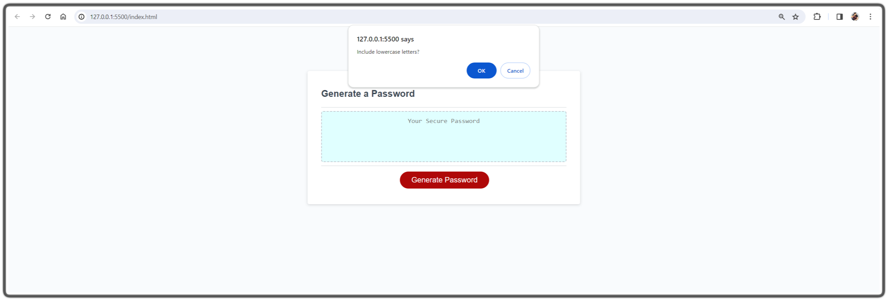
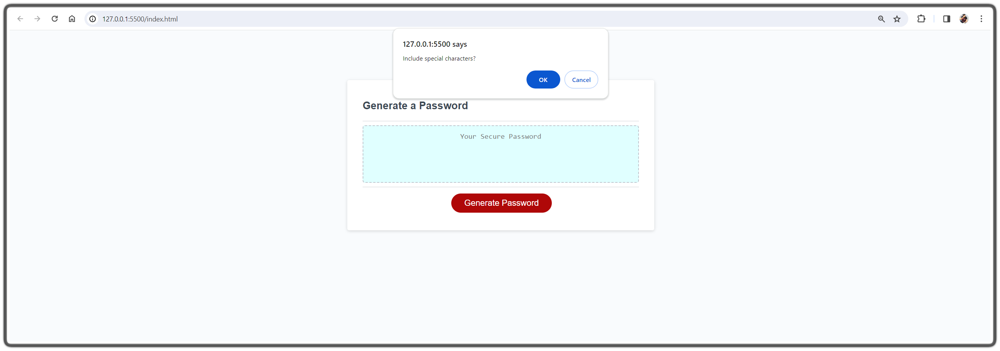
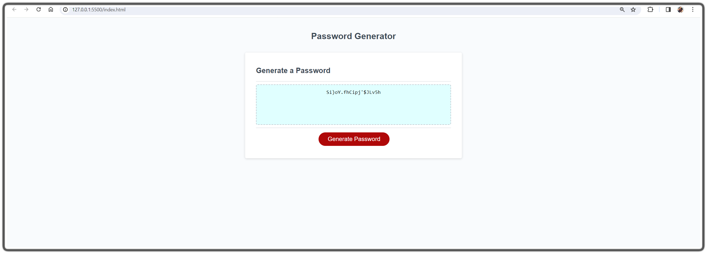

# Module 5 Challenge: Password Generator

## Overview

This week’s challenge requires to create an application that an employee can use to generate a random password based on criteria they’ve selected by modifying starter code. This app will run in the browser, and will feature dynamically updated HTML and CSS powered by JavaScript code that you write. It will have a clean and polished user interface that is responsive, ensuring that it adapts to multiple screen sizes.

## Instructions

* Generate a password when the button is clicked
  * Present a series of prompts for password criteria
    * Length of password
      * At least 8 characters but no more than 128.
    * Character types
      * Lowercase
      * Uppercase
      * Numeric
      * Special characters ($@%&*, etc)
  * Code should validate for each input and at least one character type should be selected
  * Once prompts are answered then the password should be generated and displayed in an alert or written to the page

  ## Final Screens

   ### The following images shows the web application's appearance and functionality:

  Main Page : 

  Required Password Length prompt : 

  Lower case prompt : 

  Upper case prompt : 

  Numbers prompt : 

  Special characters prompt : 

  Generated password page : 

  Invalid entry validation prompt : 

  Select at least one character type prompt : 

## Git Hub page - 

## deployed site page - 